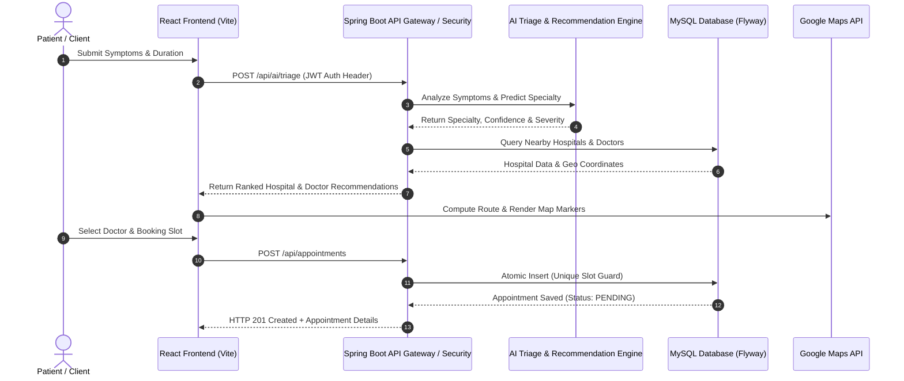

# CareFlow — AI Healthcare Navigation System

CareFlow is an AI-powered healthcare navigation platform designed to help patients find the right medical care faster by connecting symptoms, specialties, hospitals, doctors, availability, appointments, and healthcare navigation into one intelligent workflow.

---

## 1. Overview

CareFlow addresses a critical challenge in modern healthcare: helping patients navigate from initial symptoms to the right specialist and medical facility without confusion or delay. By combining intelligent symptom triage with location-aware hospital discovery and real-time appointment scheduling, CareFlow bridges the gap between patient needs and clinical care.

The platform guides users through an intuitive, end-to-end care navigation pipeline:

$$\text{Symptoms} \longrightarrow \text{AI Analysis} \longrightarrow \text{Specialty} \longrightarrow \text{Hospital Recommendation} \longrightarrow \text{Doctor} \longrightarrow \text{Time Slot} \longrightarrow \text{Appointment} \longrightarrow \text{QR Pass} \longrightarrow \text{Navigation} \longrightarrow \text{Live Care Journey}$$

> [!IMPORTANT]  
> **Medical Disclaimer:** CareFlow is designed exclusively to assist with healthcare navigation, facility discovery, and administrative appointment management. CareFlow does **NOT** provide medical diagnosis, clinical treatment advice, or emergency triage. Users experiencing medical emergencies should contact local emergency services immediately.

---

## 2. Core Features

CareFlow is built around production-tested features implemented across the frontend and backend applications:

- **AI-Assisted Symptom Navigation & Specialty Triage:** Analyzes patient symptom inputs, duration, and severity to recommend appropriate clinical specialties (e.g., Cardiology, Neurology, Orthopedics, Gastroenterology).
- **Specialty & Distance-Aware Hospital Recommendation:** Ranks healthcare facilities dynamically using Haversine physical distance calculations (in km), department availability, patient ratings, and live queue status.
- **Doctor Availability & Schedule Management:** Real-time visibility into doctor weekly schedules, slot capacities, and consultation modes (Offline / Virtual).
- **Double-Booking Protection:** Strict database unique constraint (`uk_doctor_appointment_slot`) and service-layer validation preventing overlapping appointments (returns HTTP 409 Conflict).
- **Doctor Approval Workflow:** Complete appointment lifecycle management with statuses (`PENDING`, `CONFIRMED`, `REJECTED`, `CANCELLED`, `COMPLETED`).
- **Digital QR Appointment Pass:** Instant generation of secure ZXing-encoded QR passes upon appointment confirmation for seamless hospital check-in.
- **Today Care & Live Navigation:** Dedicated real-time dashboard providing step-by-step turn-by-turn guidance and queue monitoring on appointment days.
- **Patient Dashboard & Medical History:** Centralized portal for tracking active/past appointments, uploaded health records, and personal health profiles.
- **Doctor & Admin Dashboards:** Dedicated management portals for doctors to handle schedules and appointments, and hospital managers to manage ER status, queue wait times, and bed availability.
- **Google Maps Integration:** Interactive map displays, location markers, and direct navigation links for nearby healthcare facilities.
- **Stateless JWT Authentication & Security:** Secure token-based authentication with short-lived access tokens, hashed refresh tokens, BCrypt password hashing, and fine-grained Role-Based Access Control (RBAC).
- **Automated Schema Migrations:** Versioned database evolution using Flyway migrations (V1 to V6) targeting MySQL 8.
- **Docker Containerization:** Ready-to-deploy multi-container orchestration using Docker Compose with automated health checks.

---

## 3. How CareFlow Works

The following flowchart details how a patient moves through the CareFlow ecosystem:

```mermaid
flowchart LR
    A[Patient] --> B[Describe Symptoms]
    B --> C[AI Analysis]
    C --> D[Determine Specialty]
    D --> E[Hospital Recommendation]
    E --> F[Doctor Availability]
    F --> G[Choose Appointment]
    G --> H[Doctor Approval]
    H --> I[QR Appointment Pass]
    I --> J[Navigation & Today Care]
```



### Detailed Workflow Stages

1. **Symptom Input:** The patient inputs current symptoms, pain severity, and duration into the navigation interface.
2. **AI Triage Engine:** The system processes the input and maps the symptoms to a target clinical specialty with a confidence score and recommended severity rating.
3. **Facility Matching:** Nearby hospitals offering the matched specialty are retrieved and ranked using physical distance (Haversine formula in km), rating, and real-time ER queue metrics.
4. **Doctor Selection:** The patient views qualified doctors in the chosen hospital and checks their live weekly schedule availability.
5. **Slot Reservation:** Selecting an open time slot places an appointment request in `PENDING` status. Concurrent duplicate bookings on the same slot are rejected at the database level.
6. **Provider Review:** The doctor or clinic administrator reviews the booking request in their dashboard and approves (`CONFIRMED`) or declines it.
7. **QR Pass Issuance:** Upon approval, a cryptographic QR pass is generated for the appointment.
8. **Day-of-Care Navigation:** On the appointment date, the patient activates "Today Care" for directions, check-in instructions, and live status updates.

---

## 4. User Roles

CareFlow implements strict Role-Based Access Control (RBAC) across three primary user types:

| User Role | Dashboard | Key Capabilities & Access Rights |
| :--- | :--- | :--- |
| **Patient** (`ROLE_PATIENT`) | Patient Portal | Perform AI symptom triage, discover hospitals, book appointments, access QR passes, manage health records, and view Today Care status. |
| **Doctor** (`ROLE_DOCTOR`) | Doctor Portal | Manage weekly schedule slots, view assigned patient appointments, confirm/reject bookings, mark appointments as completed, and review patient symptom notes. |
| **Hospital / Admin** (`ROLE_HOSPITAL`, `ROLE_ADMIN`) | Hospital Admin | Manage hospital department profiles, update live queue wait times, toggle bed/ICU availability, manage hospital doctors, and inspect audit logs. |

---

## 5. Technology Stack

CareFlow is engineered using modern, industry-standard technologies split across a decoupled client-server architecture:

### Frontend (`careflow-hero`)
- **Framework:** React 18 with TypeScript
- **Build Tool:** Vite
- **Styling:** Tailwind CSS with Vanilla CSS design tokens
- **Icons:** Lucide React
- **Mapping:** Google Maps JavaScript API
- **HTTP Client:** Axios / Fetch API

### Backend (`careflow-backend`)
- **Language & Runtime:** Java 21 (JDK 21)
- **Framework:** Spring Boot 3.2.5
- **Security:** Spring Security with Stateless JWT (JJWT) & BCrypt
- **Data Access:** Spring Data JPA / Hibernate (`ddl-auto: validate`)
- **Database:** MySQL 8.0
- **Migrations:** Flyway Database Migration Engine
- **QR Code Generation:** ZXing (Zebra Crossing) Core & JavaSE
- **Health Monitoring:** Spring Boot Actuator

### Infrastructure & DevOps
- **Containerization:** Docker & Docker Compose (Multi-stage Dockerfiles)
- **Build Systems:** Maven (`mvnw`) & Node.js (`npm`)

---

## 6. System Architecture

CareFlow follows a layered, service-oriented architecture designed for scalability, security, and clean separation of concerns:



---

## 7. Project Structure

The repository is structured as a clean multi-module repository with dedicated frontend and backend projects:

```
CareFlow/
├── docker-compose.yml              # Multi-container Docker orchestration
├── README.md                       # Project root documentation
├── careflow-hero/                  # React + TypeScript Frontend
│   ├── public/                     # Static web assets
│   ├── src/
│   │   ├── components/             # Reusable UI components (Navbar, Footer, Maps)
│   │   ├── context/                # React Contexts (AuthContext)
│   │   ├── pages/                  # Page Views (Landing, Login, Dashboards, AI Triage)
│   │   ├── services/               # API service clients (auth, appointment, hospital)
│   │   ├── types/                  # TypeScript interface definitions
│   │   ├── App.tsx                 # Main application routes
│   │   └── main.tsx                # Application entry point
│   ├── .env.example                # Frontend environment template
│   ├── package.json                # Node dependencies & scripts
│   ├── tailwind.config.js          # Tailwind CSS styling configuration
│   └── vite.config.ts              # Vite compiler configuration
│
└── careflow-backend/               # Spring Boot Backend
    ├── Dockerfile                  # Production multi-stage Java Dockerfile
    ├── pom.xml                     # Maven project configuration & dependencies
    ├── .env.example                # Backend environment template
    └── src/
        ├── main/
        │   ├── java/com/careflow/
        │   │   ├── admin/          # Admin & hospital management endpoints
        │   │   ├── appointment/    # Booking & appointment state logic
        │   │   ├── auth/           # Authentication, JWT, and user management
        │   │   ├── common/         # Global exception handlers & base DTOs
        │   │   ├── config/         # Security, CORS, and JPA configurations
        │   │   ├── dashboard/      # Role-specific dashboard aggregators
        │   │   ├── doctor/         # Doctor schedule & availability management
        │   │   ├── hospital/       # Hospital profiles & live queue metrics
        │   │   ├── notification/   # In-app notification services
        │   │   ├── patient/        # Patient profiles & health records
        │   │   ├── qr/             # ZXing QR Pass generation logic
        │   │   └── recommendation/ # AI symptom triage & matching logic
        │   └── resources/
        │       ├── application.yml # Base Spring Boot configuration
        │       └── db/migration/   # Versioned Flyway SQL scripts (V1__... to V6__...)
        └── test/                   # JUnit 5 backend integration tests
```

---

## 8. Authentication & Security

CareFlow enforces enterprise-grade security standards to protect patient data and system access:

1. **Stateless JWT Architecture:**
   - **Access Tokens:** Short-lived JWTs passed in the HTTP `Authorization: Bearer <token>` header.
   - **Refresh Tokens:** Cryptographically hashed refresh tokens stored in the database to issue new access tokens securely.
2. **Role-Based Access Control (RBAC):**
   - Endpoints are protected with Spring Security method annotations (`@PreAuthorize("hasRole('PATIENT')")`).
   - Unauthenticated access is restricted strictly to public endpoints (login, registration, public hospital listings).
3. **IDOR & Resource Guards:**
   - Patients can only access their own appointments, health records, and profile details.
   - Doctors can only view and update appointments assigned to their user ID.
4. **Data Hardening:**
   - User passwords are encrypted using BCrypt hashing before storage.
   - Sensitive environment variables (`JWT_SECRET`, database passwords) are loaded dynamically and excluded from version control.

---

## 9. AI Healthcare Navigation

CareFlow's AI Healthcare Navigation module converts unstructured patient symptom descriptions into actionable clinical recommendations:

- **Symptom Mapping:** Maps user-reported symptoms to medical specialties (e.g., *"chest pain and shortness of breath"* $\rightarrow$ Cardiology; *"joint pain and swelling"* $\rightarrow$ Orthopedics).
- **Severity Assessment:** Assigns risk levels based on pain scale, symptom duration, and clinical flags.
- **Intelligent Hospital Scoring:** Ranks hospitals by calculating a composite score based on:
  - Specialty department presence
  - Proximity to patient (Haversine formula in km)
  - Hospital rating
  - Current live queue wait time
  - Bed & ICU availability

---

## 10. Appointment Workflow

The appointment engine enforces strict concurrency and state transitions to prevent double-booking and operational bottlenecks:

```
[Available Slot] ──(Patient Request)──> [PENDING] ──(Doctor Confirm)──> [CONFIRMED] ──(Visit Complete)──> [COMPLETED]
                                          │                                   │
                                          ├──(Doctor Reject)──> [REJECTED]    └──(Patient Cancel)──> [CANCELLED]
```

### Double-Booking Guard Mechanism
To ensure slot consistency across concurrent requests:
1. **Database Constraint:** A unique SQL index `uk_doctor_appointment_slot (doctor_id, appointment_date, appointment_time, status)` prevents duplicate active slots at the MySQL engine level.
2. **HTTP 409 Conflict Response:** If a slot conflict occurs, the API returns a structured HTTP 409 status code with a user-friendly error payload.

---

## 11. Google Maps Integration

CareFlow integrates Google Maps JavaScript API for visual healthcare navigation:

- **Interactive Hospital Locator:** Displays nearby hospitals with custom map markers.
- **Distance Calculation:** Computes true geodesic distances in kilometers between patient geolocation and hospital facilities using the Haversine formula:
  $$d = 2R \arcsin \left( \sqrt{ \sin^2\left(\frac{\Delta \phi}{2}\right) + \cos(\phi_1)\cos(\phi_2)\sin^2\left(\frac{\Delta \lambda}{2}\right) } \right)$$
- **Navigation Links:** Generates direct Google Maps directions links for one-click turn-by-turn navigation on mobile and desktop devices.
- **Graceful Fallback:** If map scripts or API keys are unavailable, the UI seamlessly falls back to list views and calculated distances without throwing runtime exceptions.

---

## 12. Database

The database is built on **MySQL 8.0** and managed entirely through **Flyway versioned migrations**:

### Database Schema Highlights
- `users`: Core authentication identity table (email, password_hash, role).
- `patients`: Patient profiles, physical characteristics (height, weight), emergency contacts.
- `doctors`: Doctor qualifications, department specialties, consultation modes.
- `hospitals`: Hospital master records, geo coordinates (`latitude`, `longitude`), overall ratings.
- `doctor_schedules`: Weekly recurring slot allocations and maximum capacities.
- `appointments`: Booking entries with slot timestamps, status, and reference codes.
- `ai_consultations`: History of AI triage queries, predicted departments, and recommendations.
- `qr_codes`: Cryptographic tokens and paths for appointment QR passes.
- `hospital_live_status`: Real-time queue length, estimated wait times, and bed capacities.
- `audit_logs`: Operations tracking log for security compliance.

---

## 13. Environment Configuration

CareFlow relies on externalized environment variables for configuration. Sample environment templates (`.env.example`) are provided in both subprojects.

> [!WARNING]  
> Never commit real secrets, API keys, or production passwords to version control.

### Backend `.env` Variables (`careflow-backend`)

| Variable Name | Description | Example Placeholder |
| :--- | :--- | :--- |
| `DATABASE_URL` | JDBC database connection string | `jdbc:mysql://localhost:3306/careflow_db?useSSL=false&allowPublicKeyRetrieval=true` |
| `DATABASE_USERNAME` | Database connection user | `careflow_user` |
| `DATABASE_PASSWORD` | Database connection password | `YOUR_SECURE_DB_PASSWORD` |
| `JWT_SECRET` | 256-bit secret key for signing JWTs | `GENERATE_A_SECURE_SECRET_KEY_MIN_256_BITS_LONG` |
| `CORS_ALLOWED_ORIGINS` | Permitted cross-origin domains | `http://localhost:5173,https://yourdomain.com` |

### Frontend `.env` Variables (`careflow-hero`)

| Variable Name | Description | Example Placeholder |
| :--- | :--- | :--- |
| `VITE_API_BASE_URL` | Base URL of the Spring Boot REST API | `http://localhost:8080/api` |
| `VITE_GOOGLE_MAPS_API_KEY` | Public Google Maps JavaScript API key | `YOUR_GOOGLE_MAPS_API_KEY` |

---

## 14. Local Development

Follow these steps to run CareFlow locally on your development machine.

### Prerequisites
- **Java Development Kit (JDK):** Version 21 or higher
- **Node.js:** Version 18.x or higher (with `npm`)
- **MySQL Database:** Version 8.0 (running on port `3306`)
- **Git**

### Step 1: Clone the Repository
```bash
git clone https://github.com/your-username/CareFlow.git
cd CareFlow
```

### Step 2: Configure & Start Backend
```bash
cd careflow-backend

# Copy template environment file
cp .env.example .env

# Edit .env to set your local MySQL credentials and JWT secret

# Run database migrations and start Spring Boot app
./mvnw spring-boot:run
```
The backend API will start at `http://localhost:8080`.

### Step 3: Configure & Start Frontend
Open a new terminal window:
```bash
cd careflow-hero

# Copy template environment file
cp .env.example .env

# Install Node dependencies
npm install

# Start Vite dev server
npm run dev
```
The frontend application will start at `http://localhost:5173`.

---

## 15. Docker Setup

CareFlow includes full Docker containerization for one-command deployment using Docker Compose.

### Docker Architecture
- **`careflow-db`**: MySQL 8.0 database container with persistent volume storage and health checks.
- **`careflow-backend`**: Multi-stage compiled Spring Boot application container depending on DB health.

### Quick Start with Docker Compose

1. **Build and start services:**
   ```bash
   docker compose up --build -d
   ```

2. **Verify container health:**
   ```bash
   docker compose ps
   ```

3. **View live logs:**
   ```bash
   docker compose logs -f
   ```

4. **Stop services:**
   ```bash
   docker compose down
   ```

---

## 16. API Documentation

CareFlow exposes structured RESTful APIs across core application domains:

### Authentication (`/api/auth`)
- `POST /api/auth/register` — Register a new patient account.
- `POST /api/auth/login` — Authenticate and receive JWT access token.
- `POST /api/auth/refresh` — Issue a new access token using a valid refresh token.
- `POST /api/auth/logout` — Revoke active session tokens.

### AI Navigation & Recommendations (`/api/ai`, `/api/recommendations`)
- `POST /api/ai/triage` — Submit symptoms for AI specialty prediction and severity analysis.
- `GET /api/recommendations/hospitals` — Get hospital recommendations filtered by specialty and distance.

### Hospitals & Live Metrics (`/api/hospitals`)
- `GET /api/hospitals` — List all registered active hospitals.
- `GET /api/hospitals/{id}` — Retrieve hospital details and live queue status.
- `GET /api/hospitals/nearby` — Get nearby hospitals within a radius.

### Appointments (`/api/appointments`)
- `POST /api/appointments` — Book a new appointment slot (`ROLE_PATIENT`).
- `GET /api/appointments/patient/{id}` — Fetch appointment history for a patient.
- `PATCH /api/appointments/{id}/status` — Update appointment status (`ROLE_DOCTOR`).

### System Health (`/actuator`)
- `GET /actuator/health` — Spring Boot Actuator endpoint returning operational status (`UP`/`DOWN`).

---

## 17. Testing

CareFlow includes automated test coverage for backend business logic and frontend build validation:

### Running Backend Tests
```bash
cd careflow-backend
./mvnw test
```

### Running Frontend Validation
```bash
cd careflow-hero

# Type checking
npx tsc --noEmit

# Production build verification
npm run build
```

---

## 18. Production Considerations

When deploying CareFlow to production environments, adhere to the following best practices:

- **Secret Management:** Inject production secrets (`JWT_SECRET`, database passwords) using cloud vault services (e.g., AWS Secrets Manager, HashiCorp Vault) or container orchestration environment secrets.
- **HTTPS / TLS Termination:** Ensure all frontend-to-backend traffic is encrypted over HTTPS using reverse proxies (e.g., NGINX, Cloudflare).
- **Database Connection Pooling:** Optimize HikariCP connection pool settings based on production concurrency workloads.
- **CORS Hardening:** Restrict `CORS_ALLOWED_ORIGINS` to explicit production domain names.
- **Actuator Endpoint Security:** Restrict sensitive actuator endpoints while exposing `/actuator/health` to load balancer health probes.

---

## 19. Future Improvements

Planned enhancements for future releases of CareFlow:

- **Telehealth Video Consultations:** Integrated WebRTC video room support for virtual doctor visits.
- **Wearable Device Integration:** Real-time health metrics sync (heart rate, blood pressure) from smartwatches.
- **Multi-Language Internationalization (i18n):** Support for localized regional languages across symptom triage and UI navigation.
- **HL7 / FHIR Integration:** Standardized interoperability with external Electronic Health Record (EHR) systems.

---

## 20. Contributing

Contributions to CareFlow are welcome! To contribute:

1. Fork the repository.
2. Create a feature branch (`git checkout -b feature/amazing-feature`).
3. Commit your changes (`git commit -m 'Add amazing feature'`).
4. Push to the branch (`git push origin feature/amazing-feature`).
5. Open a Pull Request with a detailed description of your changes.

Ensure all automated backend tests (`./mvnw test`) and frontend type checks (`npm run build`) pass before submitting your PR.

---

## 21. License

This project is licensed under the **MIT License** — see the [LICENSE](LICENSE) file for details.

---

<p align="center">
  <b>CareFlow — Connecting Patients to Care with Intelligence and Speed.</b>
</p>
