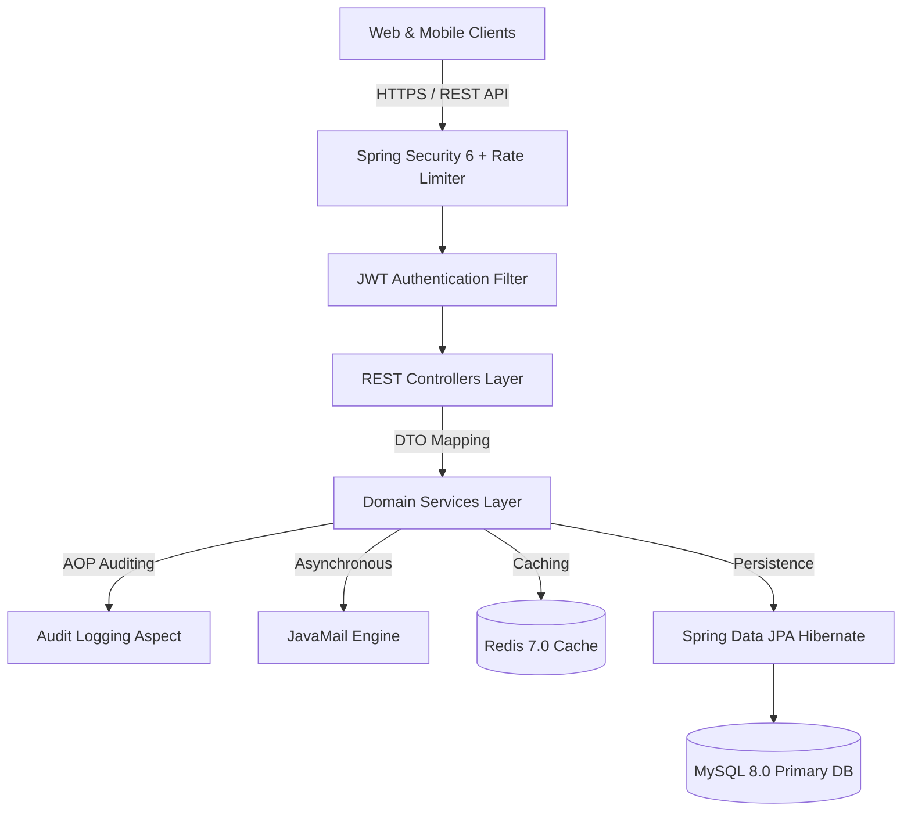
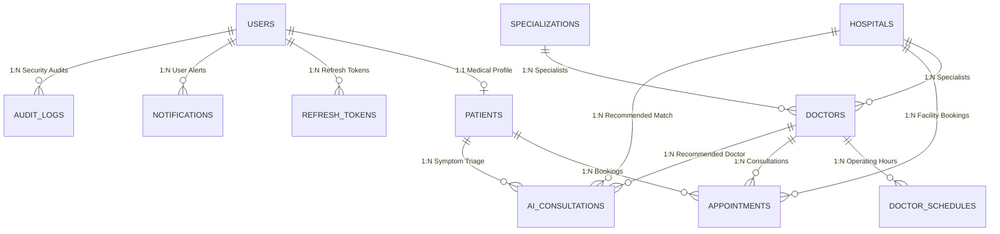

# CareFlow Enterprise AI Healthcare Platform Backend API 🏥

CareFlow is a production-ready, high-performance Java 21 & Spring Boot 3.x enterprise backend engine for AI-powered clinical triage, medical specialist appointment scheduling, hospital facility directory search, digital priority passes (ZXing QR code rendering), and patient health analytics.

---

## 🏛️ System Architecture



---

## 🗄️ Database Entity Relationship Diagram



---

## ⚡ Key Enterprise Features

1. **Clean Architecture & DDD Package Isolation**:
   - Decoupled modules (`auth`, `patient`, `hospital`, `doctor`, `appointment`, `recommendation`, `notification`, `qr`, `storage`, `dashboard`, `common`).
2. **Spring Security 6 & JJWT 0.12.5**:
   - Stateless JWT Bearer token authentication, BCrypt password hashing, refresh token rotation with explicit revocation.
3. **Redis 7 Distributed Caching (`com.careflow.common.cache`)**:
   - High-speed cache for Hospitals, Doctors, Specializations, Patient Dashboard analytics, and AI Triage history.
4. **ZXing Digital Priority Passes (`com.careflow.qr`)**:
   - Renders 300x300 PNG QR Code pass images containing encrypted verification tokens (`GET /api/v1/appointments/{id}/qr`).
5. **JavaMail HTML Email Engine (`com.careflow.common.email`)**:
   - Asynchronous HTML emails for Account Verification, Appointment Confirmation, Cancellation, and Reminders.
6. **Audit Logging AOP (`com.careflow.common.audit`)**:
   - `@AuditAction` custom annotation capturing user actions, IP addresses, timestamps, and payload metadata into `audit_logs`.
7. **JPA Search Specifications & Pagination**:
   - Multi-field filter queries (`HospitalSpecification`, `DoctorSpecification`) returning standardized `PageResponse<T>` pagination wrappers.
8. **File Storage & Media Uploads (`com.careflow.storage`)**:
   - Dedicated upload service saving images to `/uploads` (`/profiles`, `/hospitals`, `/doctors`) with 5MB max size & MIME validation.
9. **Spring Boot Actuator Monitoring**:
   - Health probes (`/actuator/health`), metrics (`/actuator/metrics`), and Prometheus metrics export.
10. **Containerization & CI/CD**:
    - Multi-stage `Dockerfile`, `docker-compose.yml` (App + MySQL + Redis), and `.github/workflows/ci-cd.yml` workflow.

---

## 🚀 Quick Start Guide

### Prerequisites
- **JDK 21**
- **Maven 3.9+**
- **Docker & Docker Compose** (Optional for containerized run)

### 1. Running with Docker Compose (Recommended)
```bash
# Clone the repository and navigate to backend directory
cd careflow-backend

# Start Spring Boot App, MySQL 8.0, and Redis 7.0
docker-compose up --build -d

# View live application logs
docker-compose logs -f careflow-backend
```

App will be available at `http://localhost:8080/api/v1`  
Swagger UI: `http://localhost:8080/api/v1/swagger-ui.html`

---

### 2. Local Manual Setup
```bash
# Configure application-dev.yml with local MySQL and Redis parameters
mvn clean spring-boot:run -Dspring-boot.run.profiles=dev
```

---

## 🧪 Testing

```bash
# Execute unit and integration tests with MockMVC
mvn clean test
```

---

## 🛡️ Default Seed Credentials

- **Admin Account**: `admin@careflow.com` / `password`
- **Doctor Specialist Account**: `doctor@careflow.com` / `password`
- **Patient Account**: `patient@careflow.com` / `password`
